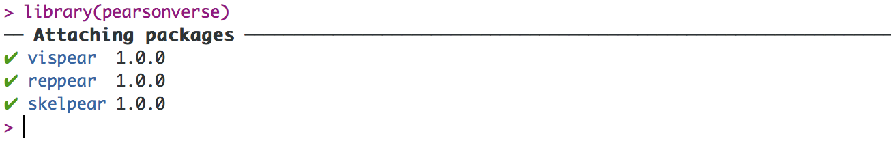
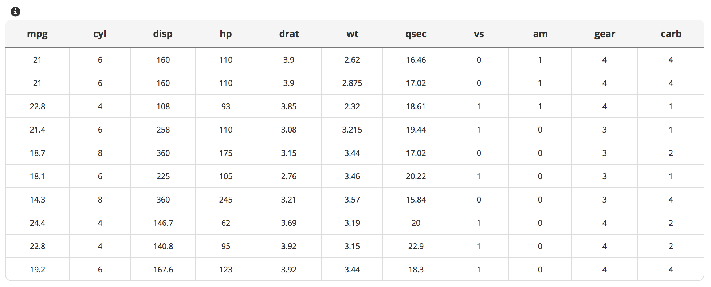
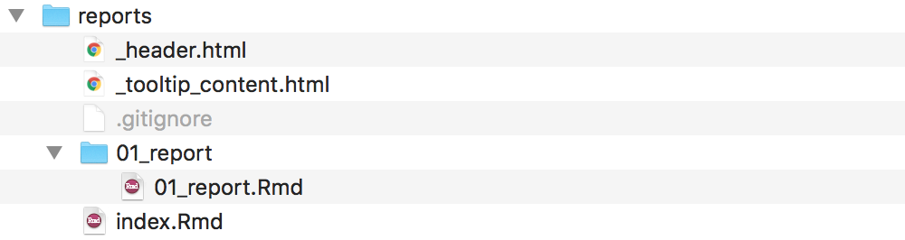

```{r setup, include=FALSE, message = F, warning = F}
options(htmltools.dir.version = FALSE)
library(ggplot2)
library(pearsonverse)

knitr::opts_chunk$set(comment = "#>")
```


## Agenda

--

- What is Pearsonverse?

--

- World before Pearsonverse

--

- Project phases using Pearsonverse

--

- Useful functions in Pearsonverse

--

- Final thoughts

---
class: center, middle

# What is Pearsonverse?

---
class: center, middle

### _Pearsonverse is a collection of packages that make it easier to conduct an exploratory data science project in R from start to end._

---
class: center, middle

# World before Pearsonverse

---
## World before Pearsonverse

--

Everybody in our team ...

--

- creates plots in different layout.

--

- uses different colour palettes.

--

- creates different project structures.

--

- uses different report templates.

---
class: center, middle

# Pearsonverse solves all those problems!

---
## Pearsonverse

--

Collection of packages: 

--

1. <a href = "https://github.com/pearsonplc/skelpear" target = "_blank">_skelpear_</a> for building a project environment and maintaining a reproducibility.

--

2. <a href = "https://github.com/pearsonplc/reppear" target = "_blank">_reppear_</a> for building a reproducible report with standardised layout.

--

3. <a href = "https://github.com/pearsonplc/vispear" target = "_blank">_vispear_</a> for creating visualisation with coherent layout.

.bottom-text[
_You can find a documentation for pearsonverse  <a href = "https://github.com/pearsonplc/pearsonverse" target = "_blank">here</a>._
]

---
## Pearsonverse

All you have to do:

```{r,eval = F}
# Install package
devtools::install_github("pearsonplc/pearsonverse")

# Attach package
library(pearsonverse)
```



---
class: center middle no-page-number
background-image: url('img/divider_blue.jpg')
background-size: 100%

# Project Phases

---
## Project phases


1. Building a project environment (_skelpear_)

--

2. Conduct analysis (_vispear_)

--

3. Produce a report (_reppear_, _vispear_)

--

4. Publish (_reppear_)

--

Throughout the whole project: Maintain reproducibility (_skelpear_)

---
class: center middle no-page-number
background-image: url('img/divider_blue.jpg')
background-size: 100%

# Building project <br>environment

---
## Project environment

.small-code[
```{r,eval=F}
skelpear::project_create(name = "project", path = ".")
```
]

--

_Two arguments_

--

`name` - Project name. Must be a valid directory name for your file system.     

--

`path` - Path where you want to store your new project.

---
## Project environment

.small-code[
```{r,eval=F}
skelpear::project_create(name = "project", path = ".")
```
]

1. After executing `project_create()`, the new RStudio session will open automatically.

--

2. The function initialises `git` environment.

---
## Project environment

.small-code[
```{r,eval=F}
skelpear::project_create(name = "project", path = ".")
```
]

--

<center></center>
--

.bottom-text[
More info about each directory in  <a href = "https://github.com/pearsonplc/skelpear" target = "_blank">documentation</a>.
]

---
class: middle, center

# Showtime

---
## Project environment + git

To push your project into __bitbucket__, two things have to be done:

--

1. Create a repository on bitbucket.    

--
2. On terminal, use `git remote add origin <remote_URL>` to link your local project with bitbucket repository.

--

After that, you're ready to push your commit/s.

---
class: center middle no-page-number
background-image: url('img/divider_blue.jpg')
background-size: 100%

# Conduct analysis

---
## Conduct analysis

_Basic layout_
.pull-three[
.small-code[
<pre>
<code class='r hljs'>
ggplot(mtcars, 
       aes(x = qsec, 
           y = mpg, 
           color = factor(cyl)
           )
       ) + 
  geom_point(size = 5)
</code>
</pre>
]]

.pull-seven[
```{r, echo=F, fig.width=13, fig.height=8, out.width="119%"}
ggplot(mtcars, aes(qsec, mpg, color = factor(cyl))) + 
  geom_point(size = 5)
```
]
---
## Conduct analysis

_theme_enr layout_
.pull-three[
.small-code[
<pre>
<code class='r hljs'>
ggplot(mtcars, 
       aes(x = qsec, 
           y = mpg, 
           color = factor(cyl)
           )
       ) + 
  geom_point(size = 5) +
  <b>theme_enr(color = p_colors)</b>
</code>
</pre>
]]

.pull-seven[
```{r, echo=F, fig.width=13, fig.height=8, out.width="119%"}
ggplot(mtcars, aes(qsec, mpg, color = factor(cyl))) + 
  geom_point(size = 5) +
  theme_enr(color = p_colors)
```
]
---
## Conduct analysis

_Save plot_ 

There are two functions:

- `save_plot()` - by default, it creates `.png` file,
- `save_plot2()` - by default, it creates two files at once, in `png` and `pdf` format.


--

.small-code[
```{r, eval = F}
plot <- ggplot(mtcars, aes(qsec, mpg, color = factor(cyl))) + 
  geom_point(size = 5) +
  theme_enr(color = p_colors)

# .png and .pdf files are created
save_plot2(name = plot, 
           file = "graphs/01_mtcars") 
```
]

.bottom-text[
Both functions are compatible with `theme_enr` layout. 
]

---
class: middle, center

# Showtime

---
## Conduct analysis

_Show palettes_

`show_enr_palettes()` funtion enables to list all available palettes defined in `vispear` package.

--

.small-code[
```{r, eval=F}
vispear::show_enr_palettes()
```

```{r,echo=F}
palette_list <- lapply(vispear::show_enr_palettes(), attributes)
data.frame(name = names(palette_list), description = unlist(unname(palette_list)))
```
]

---
## Conduct analysis

.small-code[
```{r,eval=F}
datatable_enr(mtcars, tooltip = "This is the description of table.")
```
]

<center></center>

.bottom-text[
_More info about the function in  <a href = "http://ea.ioki.pl/~mbogucki/datatable_enr.html" target = "_blank">documentation</a> (VPN required)_.
]
---
class: center middle no-page-number
background-image: url('img/divider_blue.jpg')
background-size: 100%

# Produce a report

---
## Produce a report

```{r,eval=F}
reppear::report_create(file = "01_report", subdir = "reports")
```

--

- The function creates a report template.


---
## Produce a report

```{r,eval=F}
reppear::report_create(file = "01_report", subdir = "reports")
```

--

_Two arguments_

--

`file` - Report name. Must be a valid directory name for your file system.     

--

`subdir` - Subdirectory where you want to store your new report.

---
## Produce a report

```{r,eval=F}
reppear::report_create(file = "01_report", subdir = "reports")
```

<center></center>

--

- `01_report` -  a directory which stores a report and all its dependendies. The report itself has a consistent layout.

--
- `index.Rmd` - a file which acts as a _home page_ for all reports within the project*. 

.bottom-text[
_*More info about the file in  <a href = "https://github.com/pearsonplc/reppear" target = "_blank">documentation</a>._
]

---
## Produce a report

To render _index.Rmd_, 

```{r,eval=F}
reppear::render_index()
```

--

It re/builds _index.html_, _tooltip_content.html_ and _header.html_ files.

---
class: middle, center

# Showtime

---
class: center middle no-page-number
background-image: url('img/divider_blue.jpg')
background-size: 100%

# Publish

---
## Publish 

```{r,eval=F}
reppear::publish(file = "reports/")
```

.bottom-text[
_For now only kvm1-e01.ioki.pl server is defined._
]
---
class: center middle no-page-number
background-image: url('img/divider_blue.jpg')
background-size: 100%

# Maintain <br>reproducibility

---
## Maintain reproducibility

--

```{r,eval=F}
# Save your package environment
snapshot_pkg()

# Compare package environment
compare_snapshot()
```
--

A pair of functions which allows to __save__ and __compare__ set of packages used during the project. It's especially useful when more team members are involved in code development*.

.bottom-text[
_*More info about how the functions work in  <a href = "https://github.com/pearsonplc/skelpear" target = "_blank">documentation</a>._
]
---
class: center, middle

# Final thoughts

---
## Individual goals

--

- present Pearsonverse to the broader audience

--

- propose one __github repository__ for storing useful R code produced by Lab teams

---
## Temporary contraint

--

- Pearsonverse was only tested on __macOS__. However, we plan to test it on Linux and Windows.

---
class: middle, center

# Ideas, bugs?

--

## Please write an issue on https://github.com/pearsonplc/pearsonverse/issues

---
class: middle, center

# Questions?

---
class: no-page-number
background-image: url('img/final.jpg')
background-size: 100%


